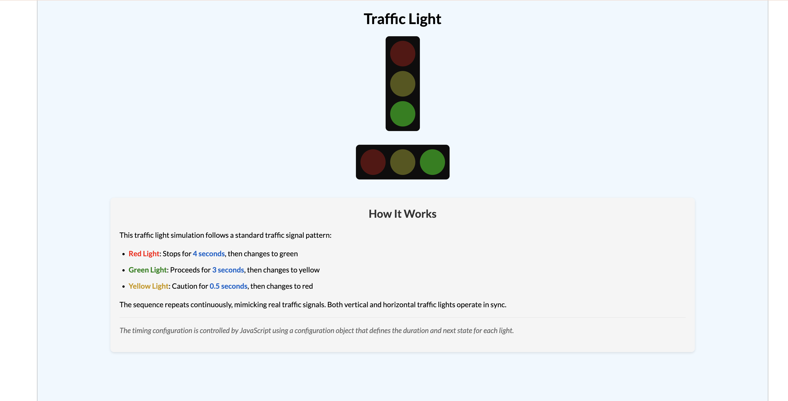

# Traffic Light Simulation



## Overview

This project is a simple yet effective traffic light simulation that demonstrates the standard traffic signal pattern using HTML, CSS, and JavaScript. The simulation includes both vertical and horizontal traffic lights that operate in sync, mimicking real-world traffic signals.

## Features

- Realistic traffic light sequence (red → green → yellow → red)
- Configurable timing for each light state
- Synchronized vertical and horizontal traffic lights
- Responsive design
- Detailed explanation of the traffic light operation

## How It Works

The traffic light simulation follows a standard traffic signal pattern:

- **Red Light**: Stops for 4 seconds, then changes to green
- **Green Light**: Proceeds for 3 seconds, then changes to yellow
- **Yellow Light**: Caution for 0.5 seconds, then changes to red

The sequence repeats continuously, mimicking real traffic signals. Both vertical and horizontal traffic lights operate in sync.

## Technical Implementation

The project uses:

- **HTML** for structure
- **CSS** for styling and animations
- **JavaScript** for functionality and timing control

The timing configuration is controlled by JavaScript using a configuration object that defines the duration and next state for each light:

```javascript
const config = {
  red: {
    duration: 4000,
    next: "green",
  },
  yellow: {
    duration: 500,
    next: "red",
  },
  green: {
    duration: 3000,
    next: "yellow",
  },
};
```

## Setup and Usage

1. Clone this repository
2. Open `index.html` in your web browser
3. Watch the traffic lights cycle through their sequence

No additional dependencies or build steps are required.

## Customization

You can easily customize the timing of each light by modifying the `duration` values in the `config` object in `script.js`. All times are in milliseconds.

## Browser Compatibility

This project works in all modern browsers that support ES6 JavaScript features.

## Author

Atikur Satter Mondal
